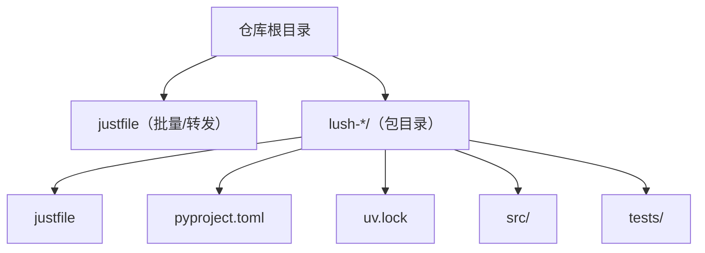
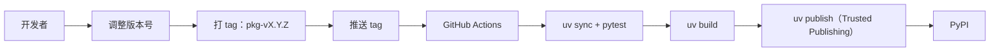

<p align="center">
  
</p>

<h1 align="center">lush-collections</h1>

<p align="center">
  一组小而独立的 Python 包合集: 集中维护, 独立发布.
</p>

| - | - |
| --- | --- |
| 项目工具 | [](https://github.com/astral-sh/uv) [](https://github.com/astral-sh/ruff) |
| Python | [](https://www.python.org/) |

## Packages

| 包 | 分发 |
| --- | --- |
| [`lush-stdx`](./lush-stdx) | [](https://pypi.org/project/lush-stdx/) [](https://pypi.org/project/lush-stdx/) |
| [`lush-logx`](./lush-logx) | [](https://pypi.org/project/lush-logx/) [](https://pypi.org/project/lush-logx/) |
| [`lush-pydanticx`](./lush-pydanticx) | [](https://pypi.org/project/lush-pydanticx/) [](https://pypi.org/project/lush-pydanticx/) |
| [`lush-dal-protocol`](./lush-dal-protocol) | [](https://pypi.org/project/lush-dal-protocol/) [](https://pypi.org/project/lush-dal-protocol/) |
| [`lush-sqlalchemyx`](./lush-sqlalchemyx) | [](https://pypi.org/project/lush-sqlalchemyx/) [](https://pypi.org/project/lush-sqlalchemyx/) |
| [`lush-redisx`](./lush-redisx) | [](https://pypi.org/project/lush-redisx/) [](https://pypi.org/project/lush-redisx/) |
| [`lush-fastapix`](./lush-fastapix) | [](https://pypi.org/project/lush-fastapix/) [](https://pypi.org/project/lush-fastapix/) |
| [`lush-sentryx-core`](./lush-sentryx-core) | [](https://pypi.org/project/lush-sentryx-core/) [](https://pypi.org/project/lush-sentryx-core/) |
| [`lush-sentryx`](./lush-sentryx) | [](https://pypi.org/project/lush-sentryx/) [](https://pypi.org/project/lush-sentryx/) |
| [`lush-wecom`](./lush-wecom) | [](https://pypi.org/project/lush-wecom/) [](https://pypi.org/project/lush-wecom/) |
| [`lush-exp`](./lush-exp) | [](https://pypi.org/project/lush-exp/) [](https://pypi.org/project/lush-exp/) |

## 简介

每个 `lush-*` 目录都是一个完整的 Python 包(独立的 `pyproject.toml` / `uv.lock` / 测试),可以单独构建、单独发布.
这里没有 uv workspace 的概念,需要改哪个就进哪个目录.

## 快速开始

- Python: `>=3.10`
- 包管理: `uv`
- 可选: `just` (根目录有 `justfile`)

根目录批量跑:

```bash
just packages
just lock
just sync
just test
```

单包开发(以 `lush-redisx` 为例):

```bash
cd lush-redisx
uv lock -p 3.10 --default-index https://pypi.org/simple
uv sync -p 3.10 --frozen --default-index https://pypi.org/simple
uv run -p 3.10 pytest
```

## 仓库结构



## 内部依赖联调

仓库内包之间通过各自的 `[tool.uv.sources]` 指向兄弟目录,用于本地联调.
对外依赖仍然写在 `[project].dependencies` 里(带版本下限),不用 workspace 也能正常安装.

## 版本与发布



每个包独立发版,推荐用 tag 来触发 GitHub Actions 发布:

- tag 约定: `<package>-v<version>` (例如 `lush-stdx-v0.1.1`)
- workflow: `.github/workflows/publish-pypi.yaml`

版本号在各自包目录里单独维护(基于 `uv version`):

```bash
just version-one lush-stdx
just bump-one lush-stdx patch
just set-version-one lush-stdx 0.1.1
```

## 一个小约定

示例与测试里尽量用 `example.com` / RFC TEST-NET 地址,不要提交真实凭据、内部域名/IP、真实用户数据.
